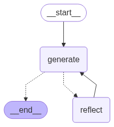

# Reflection Agent **with LangGraph**

> A minimal reproduction of the *reflection* pattern – an LLM that writes, critiques and then rewrites its own answer – built in \~100 lines of Python using **LangGraph** and **LangChain**.


[](https://smith.langchain.com/o/856312b1-7816-4389-80cb-b01e398655be/projects/p/daf255fa-b3e5-4014-9f3f-f0916221fab8?timeModel=%7B%22duration%22%3A%227d%22%7D)

---


## Table of Contents

1. [How it works](#how-it-works)
2. [Quick start](#quick-start)
3. [Project structure](#project-structure)
4. [Environment variables](#environment-variables)
5. [Acknowledgements](#acknowledgements)
6. [License](#license)

---

## How it works

### LangGraph topology



A rendered diagram is also saved as `reflection_agent.png` at runtime.

1. **generate** – Prompts the LLM with `generation_prompt` to produce a first‑pass tweet.
2. **reflect**  – Runs the draft through `reflection_prompt`, returning actionable critique.
3. The loop repeats until the message history exceeds six turns, after which LangGraph routes to **END**.

Because each reflection is wrapped as a `HumanMessage`, the model interprets the feedback as coming from the user, encouraging stronger self‑improvement.

---

## Quick start

```bash
# 1. Clone & enter
$ git clone https://github.com/ndkhoa211/reflection_agent.git
$ cd reflection_agent

# 2. Create an isolated env (uv recommended)
$ uv venv            # → .venv/
$ source .venv/bin/activate   # Windows: .venv\Scripts\activate

# 3. Install deps
$ uv pip install -e .

# 4. Add your OpenAI key
$ echo "OPENAI_API_KEY=sk-..." > .env

# 5. Run it!
$ python main.py
```

Sample console (truncated):

```
Hello LangGraph!
Draft 1: ...
Critique : ...
Draft 2: ...
...
Final tweet: ...
```

---

## Project structure

```text
reflection_agent/
├── chains.py            # prompts + LangChain Runnable
├── main.py              # LangGraph assembly & entry‑point
├── reflection_agent.png # auto‑generated mermaid diagram
├── pyproject.toml       # dependency‑pinned (uv style)
├── uv.lock              # exact package versions
└── README.md
```

---

## Environment variables

| Variable         | Purpose                 |
| ---------------- | ----------------------- |
| `OPENAI_API_KEY` | Authenticate OpenAI LLM |

All secrets are loaded from a local `.env` via **python‑dotenv**.

---

## Acknowledgements

* [LangChain – Reflection Agents blog](https://blog.langchain.dev/reflection-agents/)
* [LangGraph documentation](https://python.langchain.com/docs/langgraph)

---

## LangSmith tracing

[View live traces on LangSmith](https://smith.langchain.com/o/856312b1-7816-4389-80cb-b01e398655be/projects/p/daf255fa-b3e5-4014-9f3f-f0916221fab8?timeModel=%7B%22duration%22%3A%227d%22%7D)

---

## License

Released under the **MIT License** – see [`LICENSE`](LICENSE) for full text.
